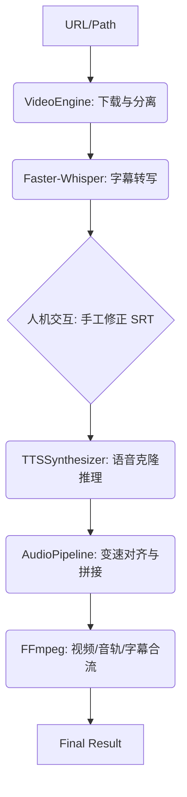

# VoiceEditor 技术架构与开发指南

本文档解析 `VoiceEditor` 的核心逻辑、算法实现及管线流转机制，旨在辅助开发者进行二次开发或优化。

## 1. 系统架构全景

`VoiceEditor` 采用三层架构设计：
1. **交互逻辑层 ([main.py](main.py))**: 负责 CLI 参数解析、环境自检、SRT 手工干预逻辑及各阶段任务编排。
2. **核心业务层 ([src/](src/))**: 封装了视频下载、音频能量检测、TTS 片段推理、时长补偿对齐等关键逻辑。
3. **算法引擎层 ([index-tts/](index-tts/))**: 基于 `IndexTTS2` (MaskGCT 架构) 的 GPT 底层推理后端。

---

## 2. 核心模块详解

### A. 智能人声提取 ([src/video_handler.py](src/video_handler.py))
为了给零样本克隆提供高质量的参考音，程序通过 `VideoEngine` 模块执行：
*   **能量图扫描**: 计算原视频音频每 0.5s 的 RMS 能量。
*   **静音过滤**: 跳过开始 60s 后的静音或背景音乐段。
*   **信噪比优先**: 自动选取连续 10s 且能量波动最稳健的片段作为 `voice_ref.wav`。

### B. 时长补偿对齐算法 ([src/tts_generator.py](src/tts_generator.py))
这是解决音画不同步的核心。由于生成音频的长度受 `diffusion_steps` 和文本长度影响，必须进行后期处理：
1. **分段推理**: `TTSSynthesizer` 遍历 SRT 并发/串行生成音频片段。
2. **时长计算**: 计算实际生成时长 $T_{actual}$ 与字幕帧时长 $T_{target}$ 的比率。
3. **非线性伸缩**: 
    *   **偏差 < 5%**: 采用简单的零填充 (Zero Padding) 或截断。
    *   **偏差 > 5%**: 调用 `pydub.speedup` 或 FFmpeg 的 `atempo` 滤镜进行变速不变调的处理（由 `src/tts/audio_pipeline.py` 实现）。

### C. 资源与环境管理 ([src/resource_manager.py](src/resource_manager.py))
所有中间产物（临时 WAV、SRT、模型缓存）均由 `ResourceManager` 统一管理。支持：
*   **原子化写入**: 确保文件完整性后再重命名。
*   **任务追踪**: 记录 `manifest.json` 以便在失败后能够断点恢复推理。

---

## 3. 工作管线 (Pipeline Flow)

## 4. 关键技术点记录

*   **FFmpeg Windows 兼容性**: 在烧录字幕滤镜时，由于 Windows 路径包含冒号 (如 `C:\`)，需使用 `replace(":", "\\:")` 逃逸，否则 FFmpeg 会解析失败。详见 [src/audio_merger.py](src/audio_merger.py)。
*   **多设备支持**: `IndexTTS2` 推理器已集成设备发现逻辑，支持 `cuda`, `mps`, `xpu`, `cpu` 自动降级，并对 `float16` 进行了算子优化。

---

## 5. 开发路线图 (Roadmap)

- [ ] **分布式推理**: 支持在大项目中使用多显卡并行处理不同的 SRT 片段。
- [ ] **OpenVINO 集成**: 针对 Intel NPU/iGPU 加速，已在 `checkpoints/openvino` 预留模型路径。
- [ ] **GUI 实时预览**: 基于 WebUI 的单句配音试听与精修。

---
*Last Updated: February 2026*

---

## 3. 工作管线 (Pipeline Flow)

## 4. 关键技术点记录

*   **FFmpeg Windows 兼容性**: 在烧录字幕滤镜时，由于 Windows 路径包含冒号 (如 `C:\`)，需使用 `replace(":", "\\:")` 逃逸，否则 FFmpeg 会解析失败。详见 [src/audio_merger.py](src/audio_merger.py)。
*   **多设备支持**: `IndexTTS2` 推理器已集成设备发现逻辑，支持 `cuda`, `mps`, `xpu`, `cpu` 自动降级，并对 `float16` 进行了算子优化。

---

## 5. 开发路线图 (Roadmap)

- [ ] **分布式推理**: 支持在大项目中使用多显卡并行处理不同的 SRT 片段。
- [ ] **OpenVINO 集成**: 针对 Intel NPU/iGPU 加速，已在 `checkpoints/openvino` 预留模型路径。
- [ ] **GUI 实时预览**: 基于 WebUI 的单句配音试听与精修。

---
*Last Updated: February 2026*
